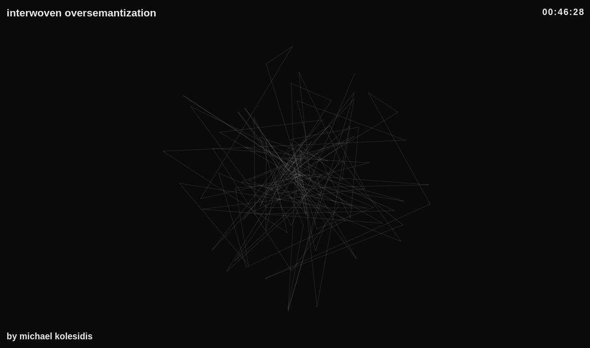
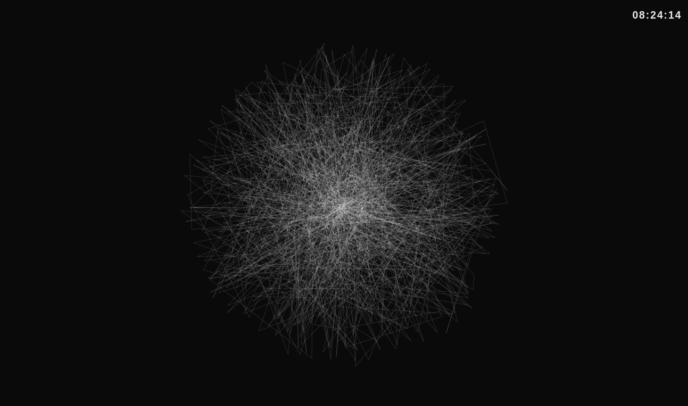
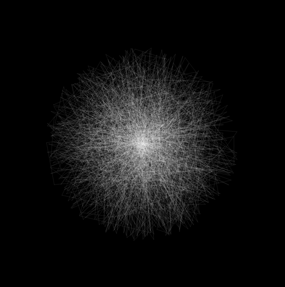

# interwoven oversemantization

A circle created dynamically by random lines.

[**Visit**](https://interwoven-oversemantization.netlify.app/)

## Info

- Resets every 10 minutes
- Resets on click
- Title and artist's name disappear after 14 seconds

## Technologies Used

&nbsp;&nbsp;&nbsp;&nbsp;&nbsp;&nbsp;

&nbsp;&nbsp;&nbsp;&nbsp;&nbsp;&nbsp;

&nbsp;&nbsp;&nbsp;&nbsp;&nbsp;&nbsp;

&nbsp;&nbsp;&nbsp;&nbsp;&nbsp;&nbsp;

## Description

A line is drawn from a point in the center of the canvas to a random point located inside an imaginary circle. Then a new line is drawn from the previous random point to a new random point, still located inside an imaginary circle.

The process is repeaded indefinitely and, using trigonometry and magic, a circle starts to form.

It is housed in a simple HTML page, with some essential CSS.

## Screenshots

## Disclaimer

Copyright (c) 2023 Michael Kolesidis - https://michaelkolesidis.com/

I am the sole copyright owner of this Work.

Reproduction of any of the artwork on this website for commercial use
is not permitted without first receiving written permission from the artist.
You cannot host, display, distribute or share this Work in any form,
including physical and digital. You cannot use this Work in any
commercial or non-commercial product, website or project. You cannot
sell this Work and you cannot mint an NFTs of it.

Under the Copyright Law, it is fair use to reproduce a single copy for personal
or educational purposes, provided that no changes are made to the content and
provided that a copyright notice attesting to the content is attached to the
reproduction. Beyond that, no further copies of works of art may be made or
distributed on this website without written permission.
