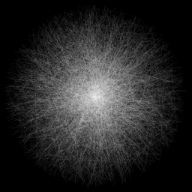
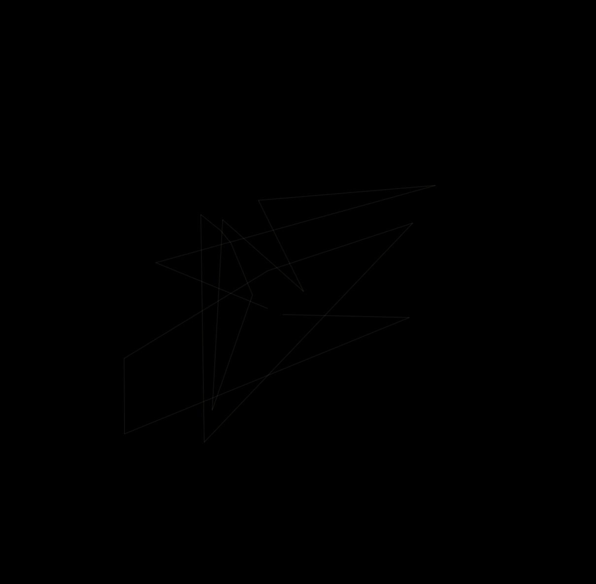

  
  <h1>Circle Random Lines</h1>

  <h3>A circle created live by random lines</h3>
  
  <a href="https://circle-random-lines.netlify.app/"><h3>Try me!</h3></a>

  
  

## Technologies Used

&nbsp;&nbsp;&nbsp;&nbsp;&nbsp;&nbsp;

&nbsp;&nbsp;&nbsp;&nbsp;&nbsp;&nbsp;

&nbsp;&nbsp;&nbsp;&nbsp;&nbsp;&nbsp;

## Description

A colorful three-dimensional cube that rotates to x-axis, y-axis, and z-axis according to the movement of  the mouse inside the window. It is created dynamically on page load, according to window dimensions. 

A line is drawn from a point in the center of the canvas to a random point located inside an imaginary circle. Then a new line is drawn from the previous random point to a new random point, still located inside an imaginary circle. The process is repeaded indefinitely and, using trigonometry and magic, a circle starts to form.It is housed in a simple HTML page, with some essential CSS.

Originally, I created it using <a href="https://processing.org/">Processing</a>, and then I ported it to the web using Processing's JavaScript sibling, p5.js.

## Demo

## Screenshot

 
 

[//]: # (Free Software)

   
   

  

                                                       

  

